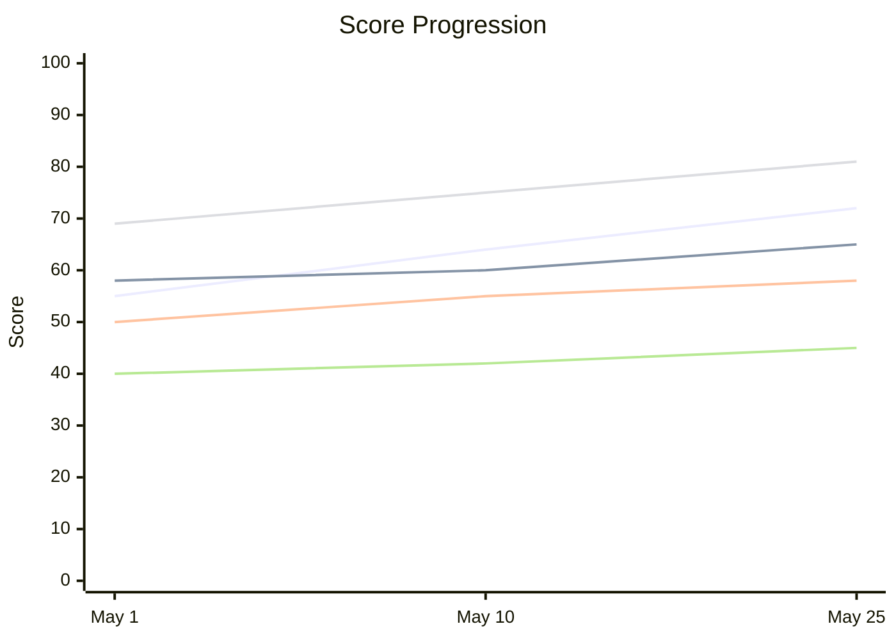

# Interaction Review — Output Formats

Templates and format specifications for all output files produced by the interaction review skill.

---

## Subagent Output Format

Each of the 5 lens agents MUST return structured markdown in this exact format:

```markdown
### Score
**Score:** [0–100]
**Justification:** [2–3 sentences explaining the score with evidence]

### Findings
[3–8 findings, each:]

#### [Lens Name] — [Specific Issue Title]
**Transcript Reference**: Session <id>, turns N–M
**What happened**: [Factual description of the interaction pattern observed]
**Why it matters**: [Impact — wasted turns, missed opportunity, compounding error, etc.]
**What to do differently**: [Concrete, actionable change the user can make next session]

### Improvement Suggestions
1. [Specific, actionable suggestion with expected impact]
2. [Specific, actionable suggestion with expected impact]
3. [Optional third suggestion]

### Delta from Previous Report
[One of:]
- "Baseline analysis — no prior data."
- "Improved: [what got better and evidence]. Regressed: [what got worse]. Unchanged: [persistent patterns]."
```

---

## Final Report Format

The final markdown report uses this structure. The HTML companion is generated from this file by `../scripts/html_render.py`.

### Front-matter

```yaml
---
title: "Interaction Review — YYYY-MM-DD"
generated_by: "$interaction-review"
generated_at: "2026-05-25T14:30:00Z"
scope: "5 sessions, 2026-05-10 to 2026-05-25"
profile: "analytical"
sessions_analyzed: 5
previous_report: "docs/interaction-review/20260510-interaction-review.md"
---
```

### Section Order

1. **Header & Meta** — Report date, sessions analyzed, date range, invocation mode, previous report link
2. **Overall Scorecard** — Weighted composite table with trend deltas
3. **Session Summary** — Per-session overview (date, turns, topic, quality signal)
4. **Per-Lens Deep Dive** (×5) — Score, justification, findings, comparison
5. **Your Next Steps** — Max 5 improvement items with full detail
6. **Coach's Note** — 2–4 sentence coaching perspective
7. **Progress Tracker** — Mermaid chart or table of score trends (multi-report only)

### Scorecard Table Format

```markdown
| Lens | Score | Grade | Trend |
|---|---|---|---|
| Prompt Craft | 72 | B- | +8 |
| Workflow Efficiency | 65 | C+ | new |
| Agentic Leverage | 58 | C | -3 |
| Error Recovery | 81 | A- | +12 |
| Context & Instruction | 45 | D+ | -- |
| **Overall** | **66** | **C+** | **+5** |
```

Trend values: `+N` (improvement), `-N` (regression), `new` (first report), `--` (no prior data for this lens).

### Improvement Item Format

```markdown
### Priority N: [What to Change]
**Why it matters:** [Connected to specific findings — cite session/turn references]
**Expected impact:** [What score/grade improvement to expect and why]
**Effort:** Quick win | Moderate | Habit change
```

### Grade Scale

| Grade | Score Range |
|---|---|
| A+ | 97–100 |
| A | 93–96 |
| A- | 90–92 |
| B+ | 87–89 |
| B | 83–86 |
| B- | 80–82 |
| C+ | 77–79 |
| C | 73–76 |
| C- | 70–72 |
| D+ | 67–69 |
| D | 63–66 |
| D- | 60–62 |
| F | Below 60 |

### Progress Tracker Chart (Mermaid)

When 3+ prior reports exist, use an xychart:

````markdown

````

When fewer than 3 data points exist, use a simple comparison table instead:

```markdown
| Lens | Previous | Current | Delta |
|---|---|---|---|
| Prompt Craft | 64 | 72 | +8 |
```
