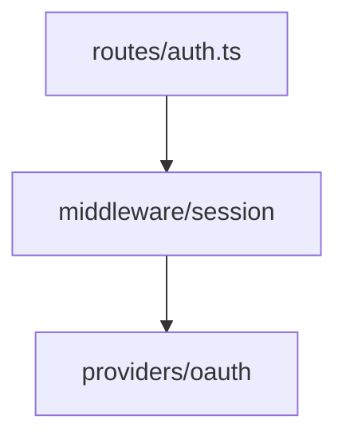

# HTML Reports — Skill Author Protocol

Skills that produce human-readable reports emit a Markdown artifact and an HTML companion. The HTML rendering happens via `scripts/html_render.py`. This doc is the contract between report-producing skills and the renderer.

## When to call the renderer

Call the renderer **after** writing the canonical Markdown artifact. Never replace the Markdown — it stays the source of truth and is what other skills re-read (`/codebase-audit analysis`, `/devlog` mining).

```python
import subprocess, sys
from pathlib import Path

SCRIPTS_DIR = Path(__file__).parent.parent / "scripts"  # path to plugin scripts/

# 1. Existing skill behavior — write the markdown.
report_path.write_text(report_markdown, encoding="utf-8")

# 2. New step — render HTML companion (best-effort, non-fatal).
try:
    subprocess.run(
        ["python", str(SCRIPTS_DIR / "html_render.py"),
         str(report_path),
         "--profile", "analytical"],
        check=True,
    )
except subprocess.CalledProcessError as e:
    print(f"⚠ HTML render failed (markdown still saved): {e}", file=sys.stderr)
```

The pattern: HTML rendering is **best-effort**. If it fails, the Markdown is still saved — users never lose content.

## Front-matter conventions

Skills can pass metadata to the renderer via YAML front-matter at the head of the markdown file. All keys are optional.

```markdown
---
title: "Authentication Module Analysis"
generated_by: "/explain"
generated_at: "2026-05-09T14:23:11Z"
scope: "src/auth/"
profile: "analytical"
---

# Body...
```

| Key | Used for |
|---|---|
| `title` | `<title>` tag and toolbar header |
| `generated_by` | Toolbar prefix (e.g., "/explain — src/auth/") |
| `generated_at` | Footer "Generated YYYY-MM-DD" line |
| `scope` | Toolbar suffix in `<code>` tags |
| `profile` | Currently informational — `--profile` CLI flag is authoritative |

If `title` is absent, the renderer falls back to the first H1 in the document, then to the filename stem.

## Enrichment blocks (Phase 1)

Phase 1 supports one enrichment block. Phase 2+ will add more.

### `mermaid` — Diagrams

Use a fenced code block with the `mermaid` language tag. Diagram source uses Mermaid syntax (flowchart, sequence, state, class, ER, gantt, etc.).

````markdown

````

The renderer wraps this in `<pre class="mermaid">`. The Mermaid library (vendored, loaded at page load) turns it into SVG client-side. The block degrades gracefully when the markdown is viewed in a non-rendering tool (just looks like a code block).

## Opt-out flags

(Phase 1 ships with the renderer behavior controlled at the renderer CLI level. Per-skill `--no-html` flags will be added in each skill's SKILL.md as part of phase rollouts.)

## Output paths

Skills should let the renderer derive the output path automatically. The renderer writes `<input>.html` next to `<input>.md` by default. Override only when there's a specific reason (e.g., centralizing all rendered reports in a different directory).
