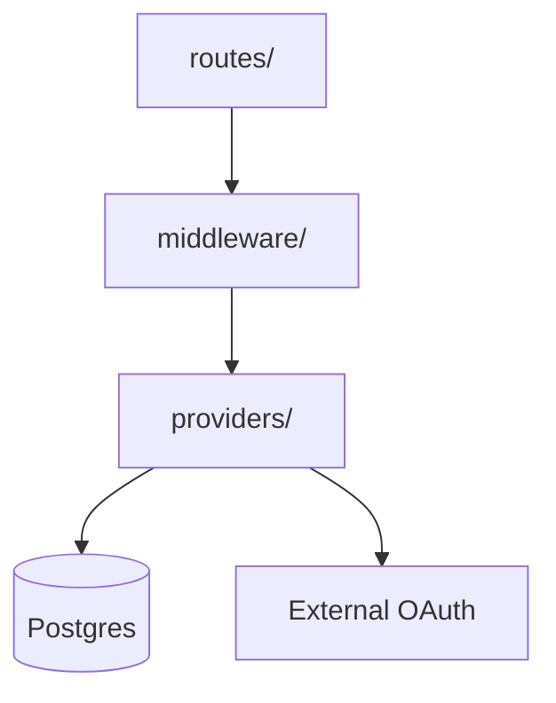
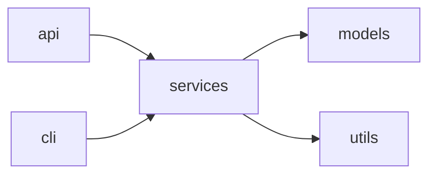
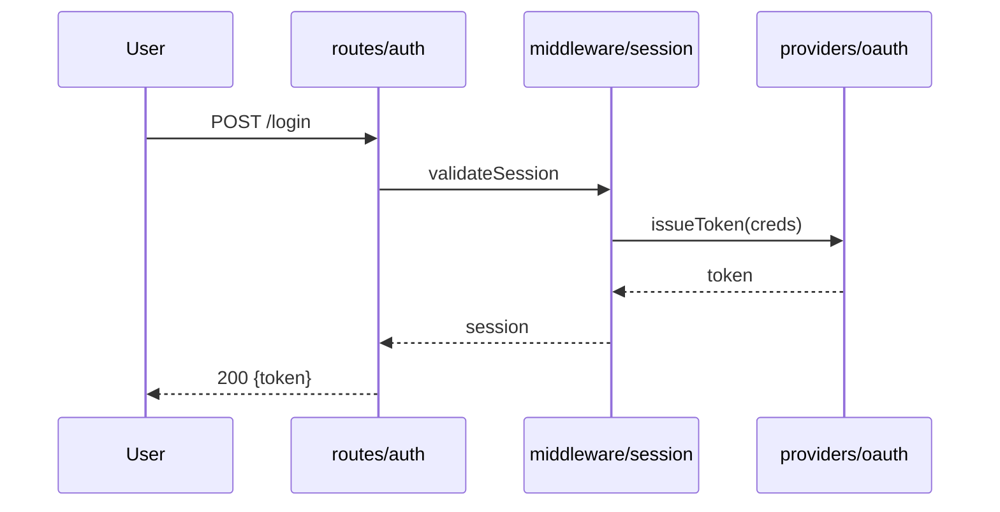
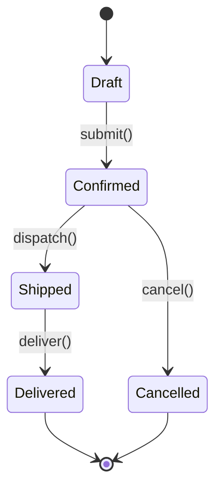
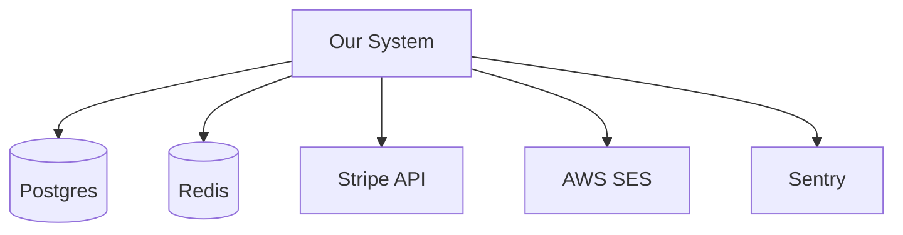

# Diagram Standards

A shared visual vocabulary for diagrams in `/explain` reports. These standards are prepended to every subagent prompt that produces diagrams.

**All graphs MUST use Mermaid syntax** (per the shared HTML-reports protocol). ASCII box-drawing is not permitted. The HTML renderer turns Mermaid blocks into SVG; Mermaid source is also readable in raw markdown.

## Syntax Patterns by Diagram Type

| Section | Diagram type | Mermaid syntax | Example |
|---|---|---|---|
| Architecture Overview (top-level) | Layered dependency graph | `graph TD` | See "Architecture / Dependency" below |
| Structure & Entry Points | Module dependency graph | `graph LR` | See "Module Dependency" below |
| Behavior — Key Workflows | Call chain / flow | `sequenceDiagram` (preferred) or `graph LR` | See "Workflow Flow" below |
| Domain & Data | State transition (optional) | `stateDiagram-v2` | See "State Transition" below |
| External Dependencies | Integration map | `graph TD` with central node | See "Integration Map" below |

## Examples

### Architecture / Dependency

````markdown

````

### Module Dependency

````markdown

````

### Workflow Flow (sequenceDiagram preferred)

````markdown

````

If branching dominates the flow (multiple error paths, conditional dispatch), prefer a `graph LR` flowchart instead.

### State Transition

````markdown

````

Include only when domain objects have clear lifecycle states. If no clear states exist, skip — don't force a diagram where prose is clearer.

### Integration Map

````markdown

````

## Adaptive Detail Rules

Scale diagram complexity to the project size. These rules apply regardless of syntax.

| Source files in scope | Top-level overview | Inline diagrams |
|---|---|---|
| < 20 files | Show all modules, entry points, and data stores | Full detail per section |
| 20–100 files | Major modules + key entry points (up to ~12 nodes) | Moderate detail |
| 100–500 files | High-level layers/modules only (up to ~8 nodes) | Key paths only |
| 500+ files | Top-level architectural layers (~5 nodes) | Abbreviated |

If a diagram would exceed these caps, summarize: group related modules into a single node, or replace breadth with prose.

## Authoring Notes

- **Node labels**: prefer `Path[label]` form (`Middleware[middleware/session]`) so the rendered SVG shows the human label while the source remains greppable.
- **Validation**: Mermaid is stricter than ASCII — a stray character breaks rendering. The renderer degrades gracefully (a broken Mermaid block falls back to a code block, same failure mode as a broken ASCII diagram). Still, prefer simple syntax over clever Mermaid features.
- **Don't over-decorate**: skip styling directives (`classDef`, `style`) — they bloat output without adding analytical value.
