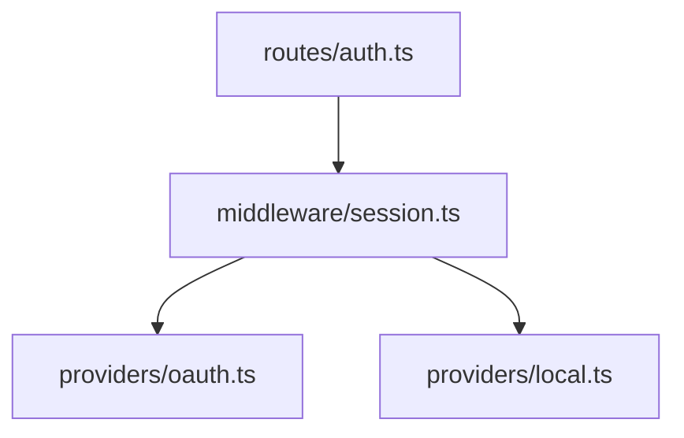

# Authentication Module

## TL;DR

OAuth2 + session cookie. Three providers wired. Critical path is the session middleware.

## Architecture Overview



The auth module is layered: routes call middleware, middleware delegates to provider modules.

## Behavior

The login flow:

```typescript
async function login(creds: Credentials): Promise<Token> {
  const provider = providers.resolve(creds.kind);
  return provider.issue(creds);
}
```

## Health & Risk

- Test coverage thin in `providers/local.ts`
- Several `// TODO` markers around rate limiting
- Session secret rotation not implemented
