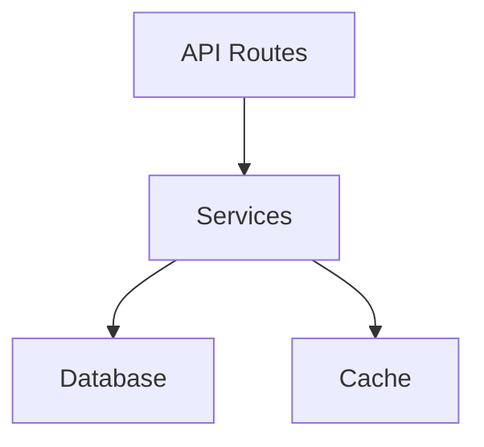

# Sample Project Handbook

> **TL;DR** — A sample project for testing handbook generation. Built with TypeScript and Express. 42 source files across 5 modules.
>
> **Quick links:** [Getting Started](#getting-started) · [Code Walkthroughs](#code-walkthroughs) · [Troubleshooting](#troubleshooting)

---

## 1. Overview & Architecture

Sample project is an HTTP API server built with Express and TypeScript.



## 2. Repository Map

| Directory | Purpose |
|---|---|
| `src/routes/` | HTTP route handlers |
| `src/services/` | Business logic |
| `src/models/` | Data models |

## 3. Getting Started

1. Clone the repository
2. Run `npm install`
3. Run `npm run dev`

## 4. Code Walkthroughs

When a request arrives, Express routes it to the appropriate handler.

<details>
<summary>View code — src/routes/index.ts:10-18</summary>

```typescript
app.get('/api/users', async (req, res) => {
  const users = await userService.findAll();
  res.json(users);
});
```

[source](../../src/routes/index.ts#L10)
</details>

## 5. Troubleshooting

> **Danger Zone: `src/billing/charge.ts`**
> Payment processing logic. Test with Stripe test mode before merging.

---

*Generated 2026-05-27T10:00:00Z at commit `abc1234` by `/handbook` v1.0.0*
